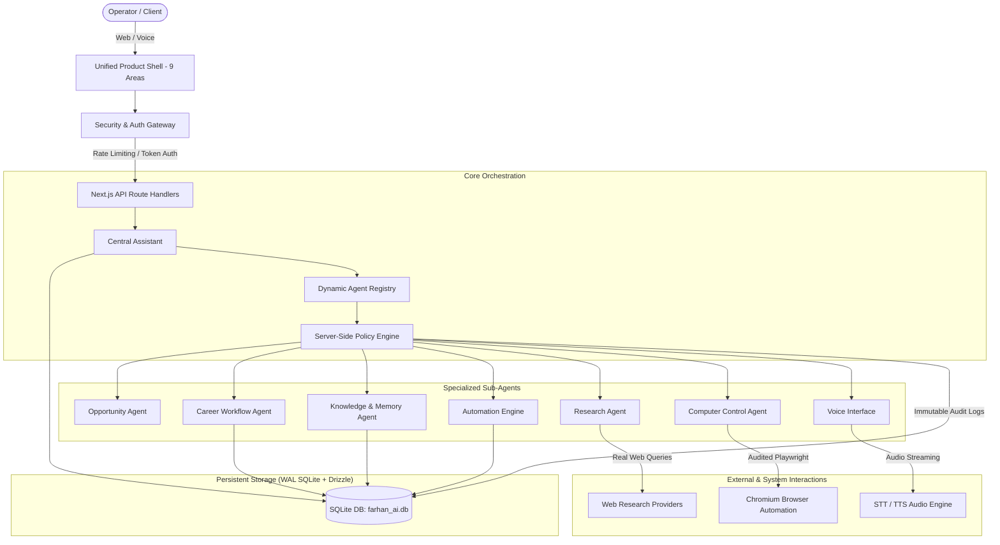

# Farhan AI v1.0 — Architecture & Technical Design

Farhan AI is an enterprise-grade personal AI career operating system built on Next.js App Router (Node.js runtime), SQLite/libsql, and Drizzle ORM.

This document details the architectural layers, subsystem interactions, security boundaries, and data models that form Farhan AI v1.0.

---

## 🏗️ High-Level System Architecture



---

## 1. Central Assistant & Dynamic Agent Registry

The Central Assistant serves as the unified conversational brain. It does not hardcode keywords or maintain isolated dialogue trees. Instead, it relies on standard LLM tool-calling conventions and a dynamic, typed **Agent Registry**.

### Agent Registry Pattern (`src/lib/agents/registry.ts`)
- **Agent Declaration**: Sub-agents register themselves with unique identifiers, descriptions, capabilities, and a collection of typed tools.
- **Tool Schema Validation**: Every tool defines input and output schemas using Zod.
- **Human Approval Flagging**: Tools declare whether they perform mutating actions (`isMutation: true`, `requiresHumanApproval: true`).
- **Context Injection**: Tool execution receives `AgentExecutionContext`, including caller identity, approval tokens, and telemetry metadata.

```typescript
export interface AgentTool<TInput = any, TOutput = any> {
  name: string;
  description: string;
  agentId?: string;
  inputSchema?: z.ZodType<TInput>;
  parameters?: z.ZodType<TInput>;
  outputSchema?: z.ZodType<TOutput>;
  requiresHumanApproval?: boolean;
  isMutation?: boolean;
  buildApprovalPayload?: (input: TInput, context: AgentExecutionContext) => HumanApprovalPayload;
  execute: (input: TInput, context: AgentExecutionContext) => Promise<ToolExecutionResult>;
}
```

---

## 2. Autonomous Career Workflow Engine

The Workflow Engine (`src/lib/workflows/`) executes multi-step, asynchronous career processes with SQLite persistence and crash recovery.

### Workflow Lifecycle
1. **Definition Registration**: Workflows are declared with ordered step definitions (`career_discovery`, `opportunity_analysis`, `application_preparation`).
2. **State Checkpointing**: After every step execution, intermediate results, step status (`PENDING`, `RUNNING`, `PAUSED_FOR_APPROVAL`, `COMPLETED`, `FAILED`), and error details are committed to SQLite.
3. **Approval Interruption**: If a step requires operator approval (e.g. `generate_proposal` before export), the workflow transitions to `PAUSED_FOR_APPROVAL`, generates an approval ID, and halts execution.
4. **Restart Recovery**: When the server process restarts, the engine inspects active workflows in SQLite and resumes from the last valid checkpoint without re-running completed idempotent steps.

---

## 3. Knowledge & RAG Architecture

Farhan AI incorporates a dual-tier knowledge system: RAG Document Retrieval and Advanced Personal Memory.

### RAG Document Pipeline (`src/lib/rag/`)
- **Multi-Format Extraction**: Dedicated parsers extract clean text, headings, and metadata from `.pdf`, `.txt`, `.md`, and `.json`.
- **Deterministic Chunking**: Text is split into bounded chunks (default 500 characters, 50 character overlap) while preserving sentence boundaries and source file metadata.
- **Vector Embeddings**: Normalized vector embeddings (64-dim mock for local/test, high-dim OpenAI/Gemini for production) are calculated per chunk.
- **Top-K Retrieval**: Vector index evaluates cosine similarity and returns ranked chunks with document titles and timestamps.

### Advanced Personal Memory (`src/lib/memory/`)
Personal facts are stored in SQLite across 8 distinct categories:
- `IDENTITY`, `SKILLS`, `EXPERIENCE`, `EDUCATION`, `PREFERENCES`, `RESTRICTIONS`, `ACHIEVEMENTS`, `METRICS`.
- **Confidence & Verification**: Each entry tracks a confidence score (0.0 to 1.0) and whether it was explicitly verified by the operator.
- **Conflict Resolution**: When an updated preference is stored, conflicting older entries are automatically marked as `SUPERSEDED` with an immutable audit trail.

---

## 4. Computer Control & Browser Automation

The Computer Control Agent (`src/lib/computer/`) enables secure browser automation via Playwright.

### Architectural Safeguards
1. **SSRF Guardrail (`src/lib/computer/network-guard.ts`)**:
   - Resolves hostnames to IP addresses before navigation.
   - Rejects loopback (`127.0.0.0/8`, `::1`), private ranges (`10.0.0.0/8`, `172.16.0.0/12`, `192.168.0.0/16`), and link-local addresses.
   - Enforces domain allowlists (e.g. `linkedin.com`, `indeed.com`, `github.com`).
2. **Action Engine (`src/lib/computer/engine.ts`)**:
   - Read actions (`navigate`, `screenshot`, `read_text`) execute under audit logging.
   - Mutating actions (`click`, `type`, `press_key`, `submit`) require an operator-confirmed approval token.
3. **Emergency STOP**:
   - Programmatic `/api/computer/stop` immediately calls `browserContext.close()` and transitions active actions to `CANCELLED`.

---

## 5. Voice Interface Architecture

The Voice Subsystem (`src/lib/voice/`) enables hands-free voice interaction without duplicating agent logic.

```text
Speech Input (Web Audio / WAV)
  ↓
Speech-to-Text (STT Provider)
  ↓
Central Assistant (Native Tool Calling & Grounding)
  ↓
Server-Side Policy Engine (Approval Verification)
  ↓
Text-to-Speech (TTS Provider)
  ↓
Spoken Output
```

### Voice Safety Binding
- When the user issues verbal approval commands (*"approve"*, *"confirm"*), the voice engine queries active pending approvals.
- **Strict Invariant**: Verbal approval is ONLY permitted if **exactly one** approval request is pending. If zero or multiple requests are pending, approval is strictly denied to prevent ambiguous executions.

---

## 6. Background Automation Engine

The Automation Subsystem (`src/lib/automation/`) executes scheduled background tasks via a persistent cron scheduler.

### Components
- **Cron Scheduler (`scheduler.ts`)**: Parses standard 5-part cron expressions and registers scheduled timers.
- **Job Runner (`engine.ts`)**: Manages job execution queues, concurrency bounds, and exponential backoff retry policies (up to 3 retries).
- **Run Tracking**: Every job invocation writes a record to `automation_runs` with start time, end time, duration, status, and output logs.
- **Crash Recovery**: Jobs interrupted by process termination are identified on startup and flagged for recovery or cleanup.

---

## 7. Storage & Database Schema

Farhan AI uses embedded SQLite (`data/farhan_ai.db`) accessed via Drizzle ORM.

### Key Database Tables
- `candidate_profile`: Verified personal career profile and metadata.
- `opportunities`: Ingested job postings with match scores and status.
- `applications`: Kanban application tracker stages and milestone notes.
- `personal_memory`: 8-category career memories, confidence, and verification flags.
- `documents` & `document_chunks`: RAG ingested documents, text chunks, and vector embeddings.
- `workflows` & `workflow_steps`: Persistent workflow executions and checkpoint state.
- `automation_schedules` & `automation_runs`: Background jobs, cron definitions, and run history.
- `computer_actions`: Playwright browser automation sessions, action payloads, and screenshots.
- `audit_logs`: Immutable system-wide audit records with actor IDs, payloads, and timestamps.
- `schema_migrations`: Versioned migration tracking (`001_baseline_schema`, `002_audit_logs`).

---

## 8. Security & Policy Enforcement Boundary

All external requests and internal agent tool executions pass through server-side authorization:
- **Authentication**: Token-based authentication (`Authorization: Bearer <token>`) protects all sensitive API endpoints in production.
- **Sliding-Window Rate Limiting**: Protects against denial-of-service with configurable IP and token rate limits.
- **Immutable Audit Logging**: Mutating actions emit structured audit records with execution status and caller identity.
- **Sanitized Telemetry**: Sensitive secrets (API keys, cookies, passwords, auth headers) are never exposed via API endpoints or UI views.
